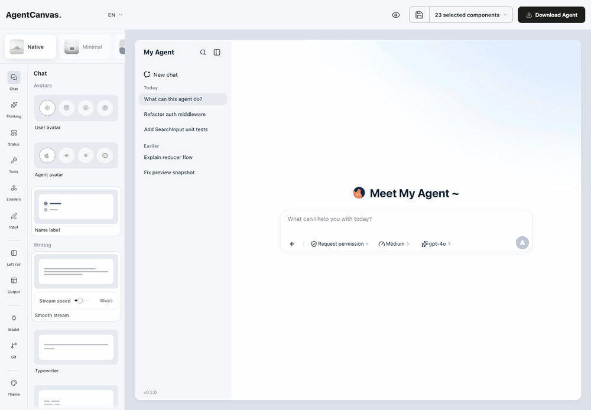

# AgentCanvas

A visual UX configurator and scaffold generator for Agent frontends.

Compose how an agent presents itself — conversation flow, reasoning disclosure,
tool-call cards, approvals, artifacts, output and Git panels — preview it
against a replaying event stream, then export a standalone React project you
can run and own.

The configurator is the mold. The agent interface you compose inside it is the
product, and that is what gets exported.



<sub>Six of the eleven modules, recorded by driving the real editor. The full pass over all
eleven is `public/landing/editor-tour.mp4`; regenerate both with
`npm run capture:tour`.</sub>

## Why

The "agent chat frontend" layer is crowded with code-first SDKs. AgentCanvas
sits one step earlier: it is a design-time surface for deciding *how* agent
events should look, with a real project as the output rather than a library you
have to wire up.

- **Configure, don't scaffold by hand.** Panels for theme, avatars, composer,
  writing cadence, content blocks, rendering, provider and Git.
- **Preview is honest.** Live preview replays a bundled demo event stream
  offline, with no keys and no tool execution.
- **Export is a real project.** One click produces a zip that runs with
  `npm install && npm run dev`. No AgentCanvas runtime dependency, no builder
  chrome, no session keys.
- **Schema-driven.** Presets resolve to an `AgentFrontendProject` object, so
  components stay independent and exportable.

## Quick start

Requires Node.js 20+.

```bash
git clone https://github.com/raytone-lab/agentcanvas.git
cd agentcanvas
npm install
npm run dev
```

The configurator is served at the `/editor.html` entry; `/` is the marketing
page. Both are built from the same Vite config.

## Scripts

| Command | What it does |
| --- | --- |
| `npm run dev` | Build workspace packages, then start Vite |
| `npm run build` | Build packages, typecheck, then production build |
| `npm test` | Full Vitest suite |
| `npm run typecheck` | `tsc --noEmit` |
| `npm run packages:verify` | Schema, SSR, clean-build and clean-consumer checks for the embeddable packages |
| `npm run test:export-smoke` | Install and build a generated scaffold for real (env-gated) |

## Repository layout

```
agentcanvas/
├── src/
│   ├── App.tsx                 configurator shell
│   ├── agentmatrix/            event-stream standard layer (go-forward)
│   ├── agentux/                legacy render runtime (preview + legacy export)
│   ├── components/             configurator UI and preview components
│   ├── export/                 scaffold export pipeline
│   │   └── templates/          source of the generated project
│   ├── schema/                 AgentFrontendProject config object
│   ├── slots/                  region/slot → component mapping
│   └── theme/                  theme tokens (6 presets)
├── packages/
│   ├── contract/               @agentmatrix/agentcanvas-contract
│   └── react/                  @agentmatrix/agentcanvas-react
├── vendor/agent-ux/            vendored prebuilt AgentUX SDK
├── examples/
├── scripts/
└── docs/
```

## Embedding

The full application is not an embeddable API. Supported integration is
provided by the versioned packages under `packages/`. See
[docs/EMBEDDABLE_PACKAGES.md](docs/EMBEDDABLE_PACKAGES.md) for package
boundaries, exact-version installation, verification, upgrades and rollback.

## Vendored SDK

`vendor/agent-ux/` holds **prebuilt** distributions of `@agent-ux/protocol`,
`@agent-ux/runtime`, `@agent-ux/render-core` and `@agent-ux/react`, resolved
through `file:` specifiers in `package.json`. They are committed because the
build needs them; the SDK source is not part of this repository.

Upstream: <https://github.com/flamingtonForAI/agent-ux-sdk> (MIT). If you need
to change SDK behavior, patch it upstream and refresh the vendored `dist`.

## Docs

- [docs/PRODUCT_TECH_GUIDE.md](docs/PRODUCT_TECH_GUIDE.md) — product scope and
  full technical walkthrough (Chinese)
- [docs/CONNECTING_AI.md](docs/CONNECTING_AI.md) — driving an exported app with a real
  model or agent: an agentic CLI's JSONL, a model API, or your own backend
- [docs/COMPONENT_SYSTEM.md](docs/COMPONENT_SYSTEM.md) — component and slot system
- [docs/EXPORT_CONTRACT.md](docs/EXPORT_CONTRACT.md) — what the exported project guarantees
- [docs/EMBEDDABLE_PACKAGES.md](docs/EMBEDDABLE_PACKAGES.md) — package boundaries
- [DESIGN.md](DESIGN.md) — design system
- [AGENTS.md](AGENTS.md) — conventions for coding agents working in this repo

## Contributing

See [CONTRIBUTING.md](CONTRIBUTING.md).

## License

[MIT](LICENSE) © Raytone-Lab

Third-party and vendored code is listed in
[THIRD_PARTY_NOTICES.md](THIRD_PARTY_NOTICES.md).
